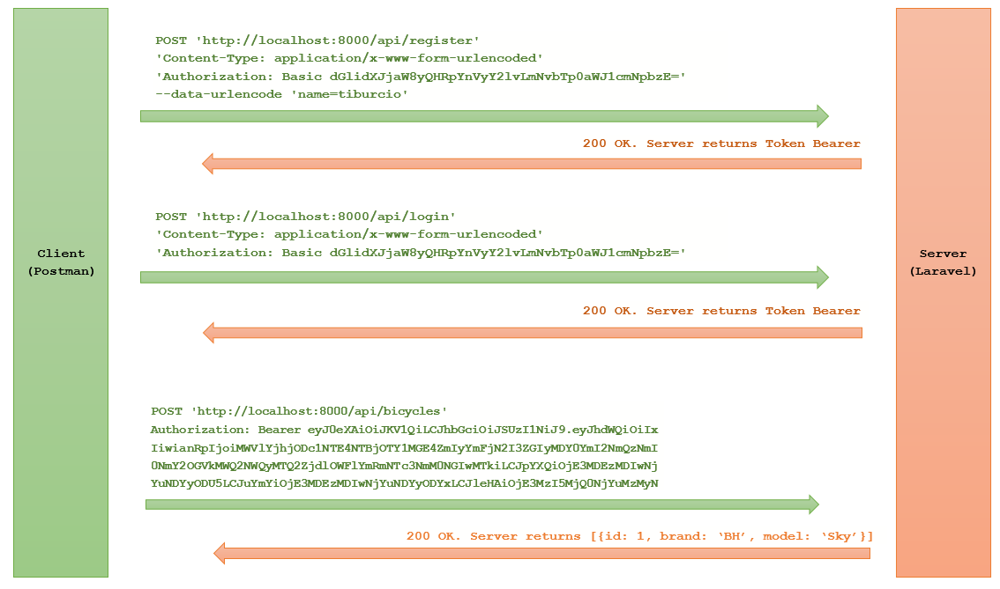
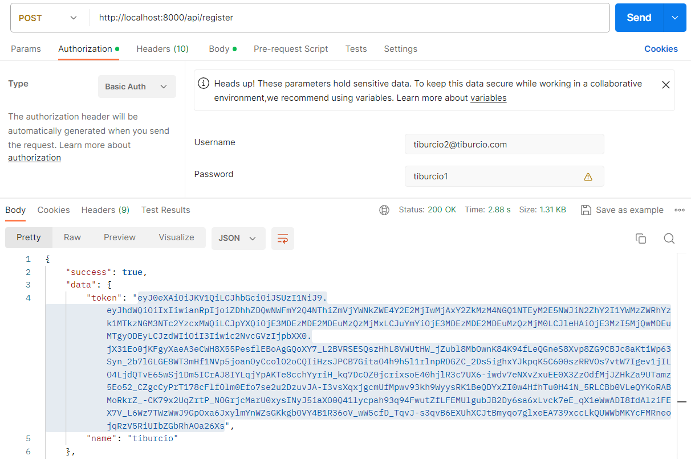
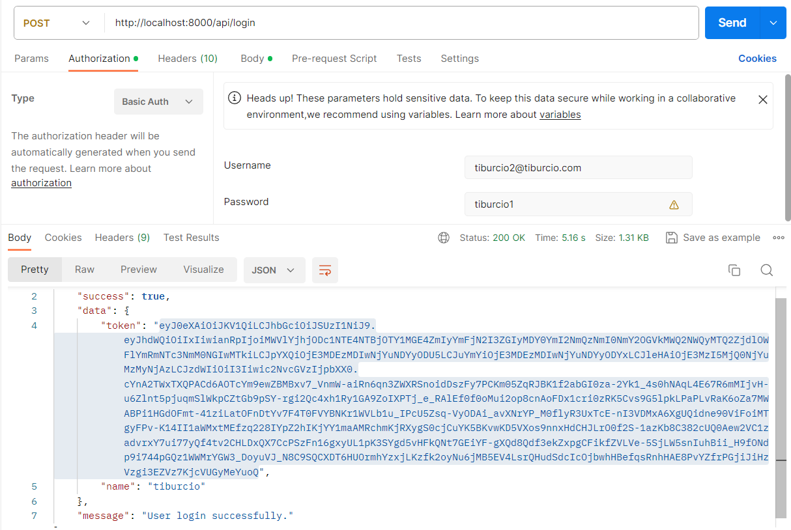
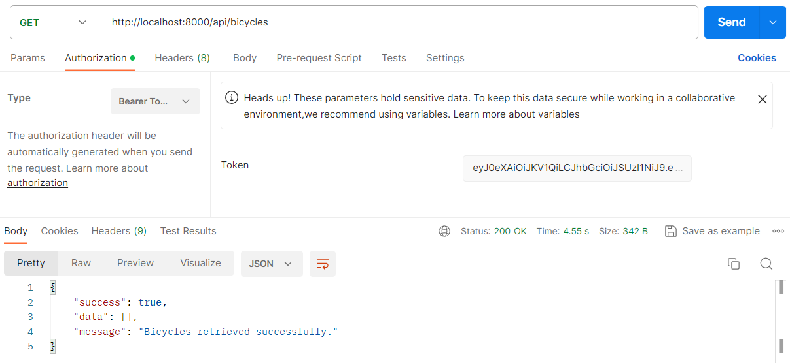

# Laravel 10 API Basic Auth and Bearer Authentication

It's just that: A Laravel 10 example with Basic Auth and Bearer Authentication.

## Getting Started

The Basic Auth and Token Bearer work together and consists of doing the following steps:
1. Frontend sends an Authorization header with username and password concatenated by ":" and then encoded in Base64. 
2. Backend receives the request with the header, decodes the base64 encoded Authorization header, and extracts both the password and username.
3. Backend uses bcrypt to encrypt the password and create the user in the database.
4. Backend creates a bearer token and returns it to the frontend.
5. Frontend uses the bearer token for next requests.

The 5 steps can be seen in the following diagram:



__________________________________________________________

In this example I have followed this tutorial for Bearer Authentication:
https://www.itsolutionstuff.com/post/laravel-10-rest-api-with-passport-authentication-tutorialexample.html?utm_content=cmp-true#google_vignette

After that I have added a function to the RegisterController that implements the Basic Auth. This is the function code:

```
private function extractBasicAuthData(Request $request)
{
    $header = $request->header('Authorization');
    if(!Str::startsWith($header, 'Basic ')){
        return null;
    }

    $encoded = explode('Basic ', $header);
    $decoded = base64_decode($encoded[1]);
    list($email, $password) = explode(":", $decoded);

    $dataDecoded = $request->all(); //only name should be there
    $dataDecoded['email'] = $email;
    $dataDecoded['password'] = $password;

    return $dataDecoded;
}
```

### Before starting

You need a working Laravel environment. You can do it using Laragon for example. In my case I use WSL2 in a Windows 11 machine.

### Running this project

Clone this project:

````
git clone https://github.com/tcrurav/Laravel10BasicAndBearerAuth.git
````

Create a .env. You can just copy .env.example to .env, and edit the database credentials.

After that create the database in MySQL.

And then execute the following commands:

````
composer install
php artisan migrate
php artisan serve
````

After that try the POSTMAN request to register a new user using Basic Auth:



__________________________________________________________

And now the POSTMAN request to login using Basic Auth:



__________________________________________________________

Now you can use the token to get all bicycles using a token bearer obtained after the login in previous step:



__________________________________________________________


Enjoy!!!

### Prerequisites

All you need is... some time and...
* Visual Studio Code.
* Laravel 10.
* PostMan, for the RESTFul tests.
* More hours than you first could think of...

## Built With

* [Visual Studio Code](https://code.visualstudio.com/) - Visual Studio Code Editor.
* [WSL2](https://ubuntu.com/tutorials/install-ubuntu-on-wsl2-on-windows-11-with-gui-support#1-overview) - Install Ubuntu on WSL2 and get started with graphical applications.

## Links you might find interesting

* [Laravel 10 REST API with Passport Authentication Tutorial](https://www.itsolutionstuff.com/post/laravel-10-rest-api-with-passport-authentication-tutorialexample.html?utm_content=cmp-true#google_vignette) - Very simple tutorial this example is based on for Bearer Auth.
